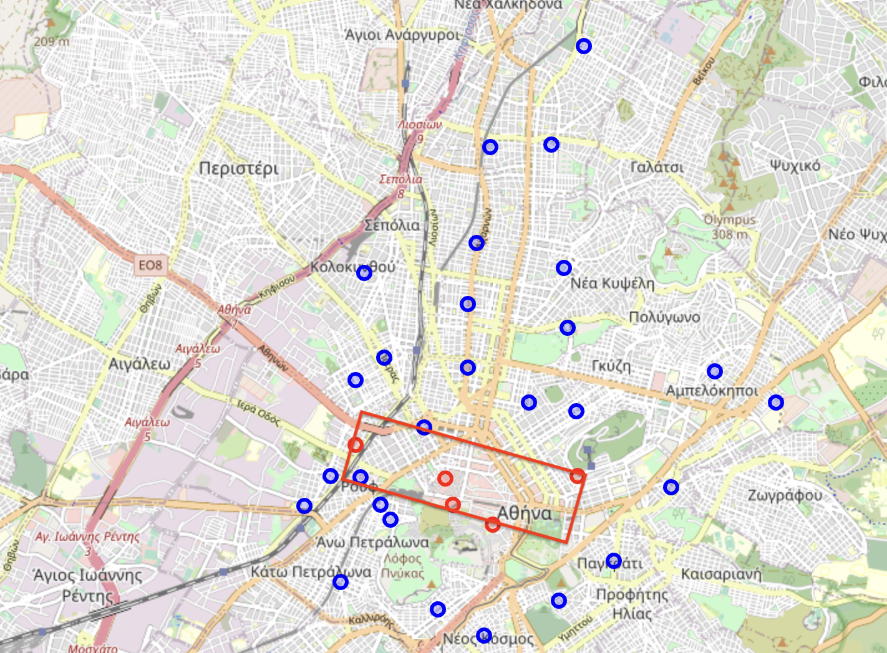
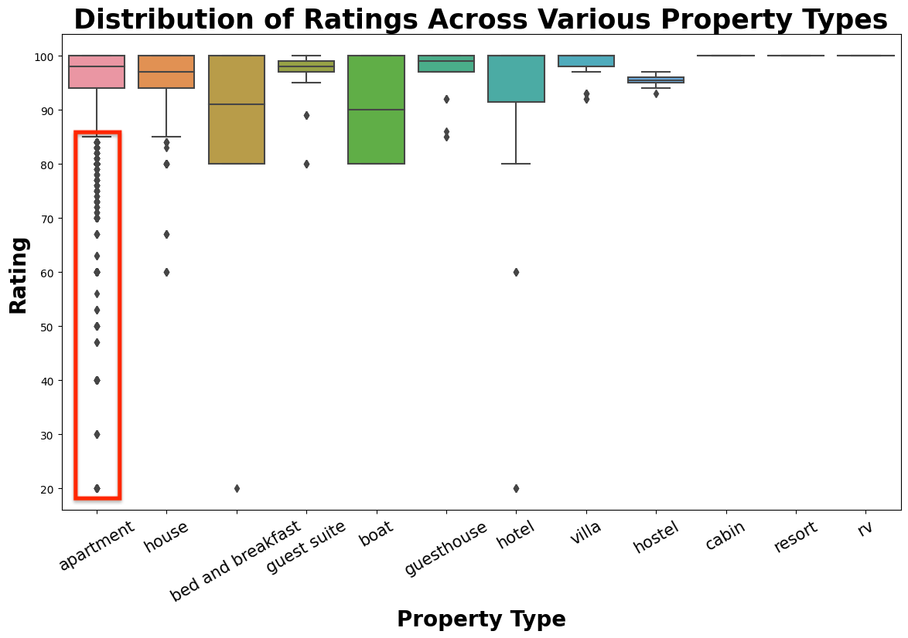
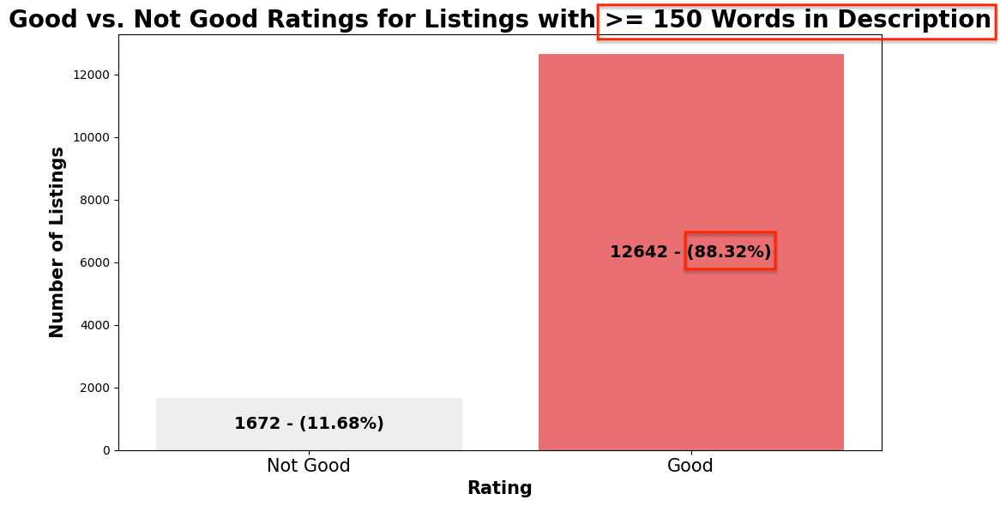

<h1 align="center">Airbnb Recommendation System</h1>

## Disclosure
This repository is dedicated solely to academic pursuits. It maintains no affiliations with any corporations, and does not house or process personally identifiable information (PII) associated with these entities. All users and contributors are urged to adhere to strict data protection guidelines and not to share or solicit sensitive data within this platform.


## Overview Of Business Problem
Airbnb is aiming to leverage the surge in travel/tourism to Athens, Greece. Leadership would like to identify key indicators that forecast a positive customer experience at a property. By determining these predictors, they hope to align property recommendations more closely with customer preferences which, we predict, will enhance overall satisfaction.


## Understanding The Data
In the folder ```Data``` is a single datasets focused on Airbnb Hosts and Property Details/Ratings. Below are the features provided:

- Numerical columns: 
['id', 'latitude', 'longitude', 'accommodates', 'bathrooms', 'bedrooms', 'beds', 'minimum_nights', 'availability_365', 'number_of_reviews', 'review_scores_rating']

- Categorical columns: 
['month', 'name', 'description', 'transit', 'host_since', 'host_response_rate', 'host_has_profile_pic', 'host_identity_verified', 'neighbourhood', 'city', 'zipcode', 'property_type', 'room_type', 'bed_type', 'amenities', 'price', 'first_review', 'last_review', 'instant_bookable', 'cancellation_policy']


### Analysis of Price in Relation to Downtown Proximity and Customer Satisfaction
- The closer to Downtown Athens you are, more more likely the prperty will be expensive



### Analysis of Property Types in Relation to Customer Satisfaction
- It seems that apartments have the largest amount of low ratings



### Analyzing Description Word Count & Relation to Customer Satisfaction
- Listings with descriptions of 150 words or more received positive reviews in nearly 89% of cases



## Modeling
* The Model used is a Recommnder System to predict similar listings based on customer preferences.


## Conclusion
Customer satisfaction predictors we recommend implimenting along with customer preference are:

- The price has little impact on customer satisfaction of their stay. Recommend more expensive listings if walkability to downtown is very important to the customer.
- The property-type is very important when considering customer satisfaction. Apartments have the highest dissatisfaction of all property types. try avoiding them.
- In the event someone selects an apartment, we have found that the listing descriptions of 150 words or more received positive reviews in nearly 89% of cases. Boost these for the best customer satisfaction.


## Repository File Structure
```
├── data
    ├── airbnb_data.csv.zip
├── images
├── .gitignore
├── Airbnb_recsys_analysis.ipynb
├── LICENSE
└── README.md
```
